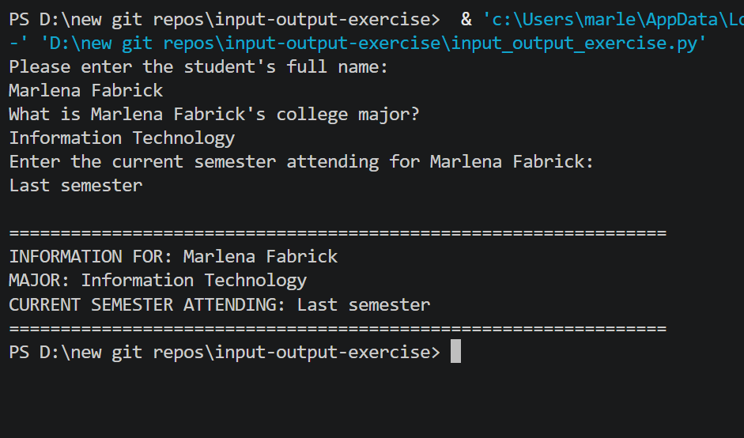
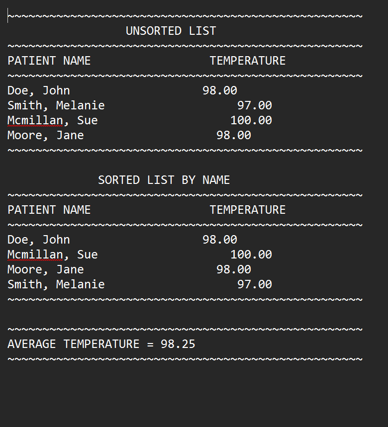

# 🏥 Patient Stats — Lists, Bubble Sort, and Average Temperature

A Python program that collects patient names and temperatures, displays unsorted and bubble-sorted lists, calculates the average temperature, and writes all output to an external text file.

---

## ✨ Features

- Prompts for a user-defined output file name
- Validates that the patient count is a positive whole number
- Collects patient name and temperature for each record
- Validates temperature input — rejects non-numeric values
- Displays the unsorted patient list to the console and output file
- Sorts the list alphabetically by patient name using a bubble sort algorithm
- Keeps name-temperature pairs together during the sort
- Calculates and displays the average temperature
- Writes all output (both lists + average) to a `.txt` file

---

## ⚙️ How It Works

1. User enters a name for the output file (include `.txt` extension e.g. `patients.txt`)
2. User enters how many patient records to process
3. WHILE loop collects each patient's name and temperature
4. Unsorted list is displayed to the console and written to the output file
5. Bubble sort algorithm sorts the list alphabetically by name — temperatures follow their patient
6. Sorted list is displayed and written to the output file
7. Average temperature is calculated and written to the output file
8. File is closed and user is notified

---

## 📄 Example Output File

```
~~~~~~~~~~~~~~~~~~~~~~~~~~~~~~~~~~~~~~~~~~~~~~~~~~~
                 UNSORTED LIST
~~~~~~~~~~~~~~~~~~~~~~~~~~~~~~~~~~~~~~~~~~~~~~~~~~~
PATIENT NAME                 TEMPERATURE
~~~~~~~~~~~~~~~~~~~~~~~~~~~~~~~~~~~~~~~~~~~~~~~~~~~
Williams, Robert                   98.60
Johnson, Mary                      101.20
Adams, Frank                       99.40
~~~~~~~~~~~~~~~~~~~~~~~~~~~~~~~~~~~~~~~~~~~~~~~~~~~

             SORTED LIST BY NAME
~~~~~~~~~~~~~~~~~~~~~~~~~~~~~~~~~~~~~~~~~~~~~~~~~~~
PATIENT NAME                 TEMPERATURE
~~~~~~~~~~~~~~~~~~~~~~~~~~~~~~~~~~~~~~~~~~~~~~~~~~~
Adams, Frank                       99.40
Johnson, Mary                      101.20
Williams, Robert                   98.60
~~~~~~~~~~~~~~~~~~~~~~~~~~~~~~~~~~~~~~~~~~~~~~~~~~~

~~~~~~~~~~~~~~~~~~~~~~~~~~~~~~~~~~~~~~~~~~~~~~~~~~~
AVERAGE TEMPERATURE = 99.73
~~~~~~~~~~~~~~~~~~~~~~~~~~~~~~~~~~~~~~~~~~~~~~~~~~~
```

---

## 📸 Screenshot



## Text File Output


---

## 🐛 Bug That Was Fixed

The original program asked for the number of patients, validated it into one variable, then immediately asked for the count again and overwrote it — so the validated value was never actually used:
```python
size = int(input("How many patients?"))  # first ask
# ...validation...
size = int(input("How many patients?"))  # overwrote with unvalidated value
```
Fixed by using the validated `size` value directly without re-asking, eliminating the double-input.

---

## 🛠️ Technologies Used

- Python 3
- Python lists — `[""] * size` and `[0.0] * size` to initialize
- WHILE loops — for data collection, accumulation, and display
- Bubble sort algorithm — nested WHILE loops with flag variable
- File I/O — `open()`, `write()`, `close()`
- `while True / try/except` — input validation
- `toFixed()` helper function — formatted decimal output

---

## 📚 Learning Outcomes

- Creating and populating parallel lists (names + temperatures)
- Bubble sort algorithm keeping paired data in sync
- WHILE loop with a flag variable for sort termination
- Accumulator pattern for averages
- Writing formatted tabular output to an external text file
- Input validation for both count and float values

---

## ▶️ How to Run

1. Make sure Python 3 is installed: https://www.python.org/downloads/
2. Clone or download this repo
3. Open a terminal in the repo folder
4. Run: `python patient_stats.py`
5. Enter a filename when prompted (include `.txt` e.g. `patients.txt`) — the report will be created in the same folder

---

## 📁 Folder Structure

```
patient-stats/
├── patient_stats.py
├── output.png
├── txt_output.png
├── patient_stats.txt
├── README.md
├── LICENSE
└── .gitignore
```

---

## 📜 License

This project is licensed under the MIT License — see the [LICENSE](LICENSE) file for details.

---

*Written by Marlena Fabrick — Computer Programming, Fall 2020*
